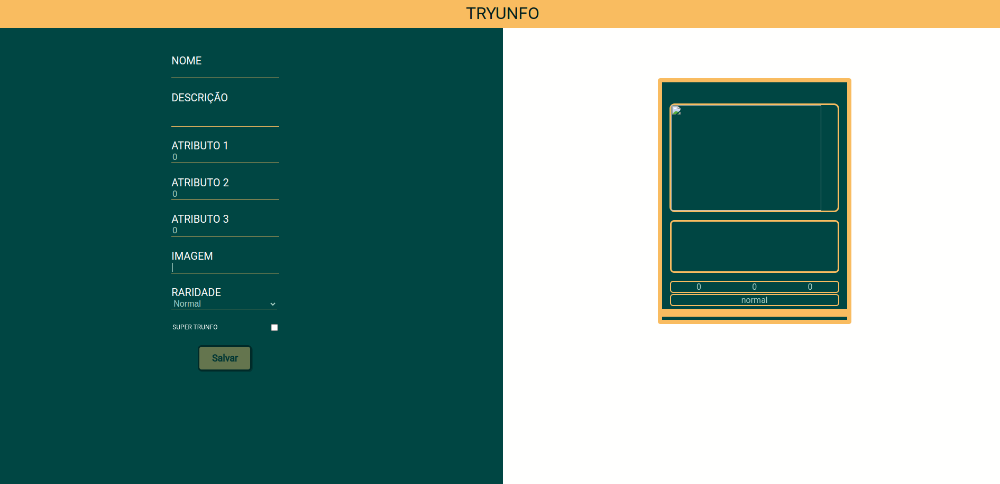
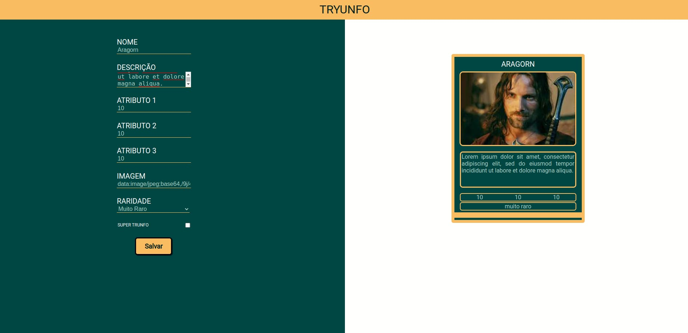

# PROJETO TRYUNFO

## Introdução

Projeto desenvolvido no módulo de front-end na [Trybe](https://www.betrybe.com/), onde criamos uma página em React capaz de gerar cartas de um baralho Super Trunfo. O usuário pode criar as cartas com o tema livre, é possível adicionar diversas cartas ao baralho e visualizar sua criação em tempo real.

## Sumário

- [Introdução](#introdução)
- [Stack Utilizada](#stack-utilizada)
- [Aprendizados](#aprendizados)
- [Instruções para utilizar a aplicação](#instruções-para-utilizar-a-aplicação)
- [Preview](#preview)

## Stack utilizada

**Front-end:** JavaScript
**Front-end:** React
**Front-end:** CSS

## Aprendizados

Fui capaz de colocar o aprendizado de React e JavaScript em prática. Atualizando o estado de um componente, capturar eventos utilizando React, ler o estado de um componente e usá-lo para alterar o que é exibido na tela.

## Instruções para utilizar a aplicação

Para utilizar a aplicação você precisará ter o [node](https://nodejs.org/en/download/) e [npm](https://docs.npmjs.com/downloading-and-installing-node-js-and-npm) instalados.

Após instalar o node e npm, você precisará usar o comando `npm install` para instalar as dependências do repositório.

Você poderá utilizar o comando `npm start` para exibir a página da aplicação.

# Preview

**Preview Image**
---
 

**Card Image**
---
 